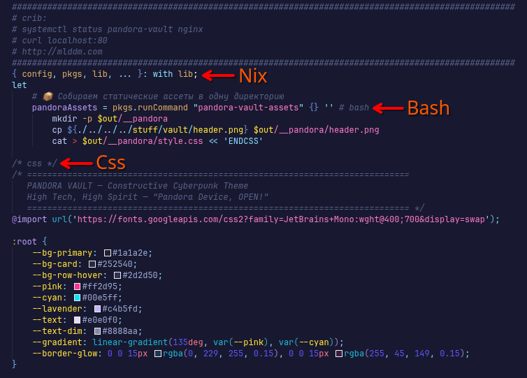

# Nix Embedded Highlighter 

[](https://marketplace.visualstudio.com/items?itemName=atomicspirit.nix-embedded-highlighter)
[](https://open-vsx.org/extension/atomicspirit/nix-embedded-highlighter)

A lightweight VS Code / VSCodium extension that brings **native syntax highlighting** to embedded languages within Nix multiline strings (`'' ... ''`). 

Designed for the **Digital Phoenix** ecosystem, built for Nixers who are tired of looking at grey walls of text in their `shellHook`, `extraConfig`, or `runCommand` blocks.



## Requirements
This extension requires the standard [Nix IDE](https://marketplace.visualstudio.com/items?itemName=jnoortheen.nix-ide) to be installed, as it injects its rules directly into `string.quoted.other.nix`.

## How it works

Just drop a comment language tag immediately after the opening `''` in your Nix file. The extension uses [TextMate Grammar Injections](https://code.visualstudio.com/api/language-extensions/syntax-highlight-guide#injection-grammars) to overlay the correct syntax highlighting without breaking the host Nix language scope.

**Zero dependencies. Lightning fast.**

### Example

```nix
shellHook = '' # bash
    echo "This is now properly highlighted as Bash!"
    if [ -d /tmp ]; then
        ls -la /tmp
    fi
'';
```

## Supported Languages

| Language Tag    | Scope Injected      | Common Use Case                               |
|-----------------|---------------------|-----------------------------------------------|
| `# bash`        | `source.shell`      | `shellHook`, `phases`, `pkgs.runCommand`      |
| `# python`      | `source.python`     | `writers.writePython3`                        |
| `# ruby`        | `source.ruby`       | `bundlerEnv`, scripts                         |
| `# json`        | `source.json`       | generating `.json` config files               |
| `# toml`        | `source.toml`       | `Cargo.toml`, `pyproject.toml` via writeText  |
| `# yaml`        | `source.yaml`       | generating `.yml` config files                |
| `# css`         | `source.css`        | inline styles                                 |
| `/* css */`     | `source.css`        | alternative CSS block tag                     |
| `# html`        | `text.html.basic`   | `nginx` extra configurations                  |
| `<!-- html -->`  | `text.html.basic`   | alternative HTML block tag                    |
| `# xml`         | `text.xml`          | libvirt domains, systemd units                |
| `<!-- xml -->`   | `text.xml`          | alternative XML block tag                     |
| `# sql`         | `source.sql`        | NixOS PostgreSQL modules                      |
| `# lua`         | `source.lua`        | Neovim configurations                         |
| `# javascript`  | `source.js`         | `writeScript`, node packages                  |
| `# ini`         | `source.ini`        | systemd units, config files                   |
| `# perl`        | `source.perl`       | nixpkgs internals                             |

### Deep Nesting
It even works with nested multi-line strings generated natively by builders:

```nix
myConfig = pkgs.writeText "config.yaml" '' # bash
    cat > $out << 'EOF'

    # yaml
    server:
      port: 8080
      host: 0.0.0.0
    EOF
'';
```

## Philosophy
*Deceptive Simplicity.* The plugin consists of three core files and relies entirely on VS Code's native grammar engine. It does not spawn background processes or parse ASTs. It simply tells the editor how to interpret the text you were already writing.

*"Pandora Device, OPEN!"*

## License
MIT
